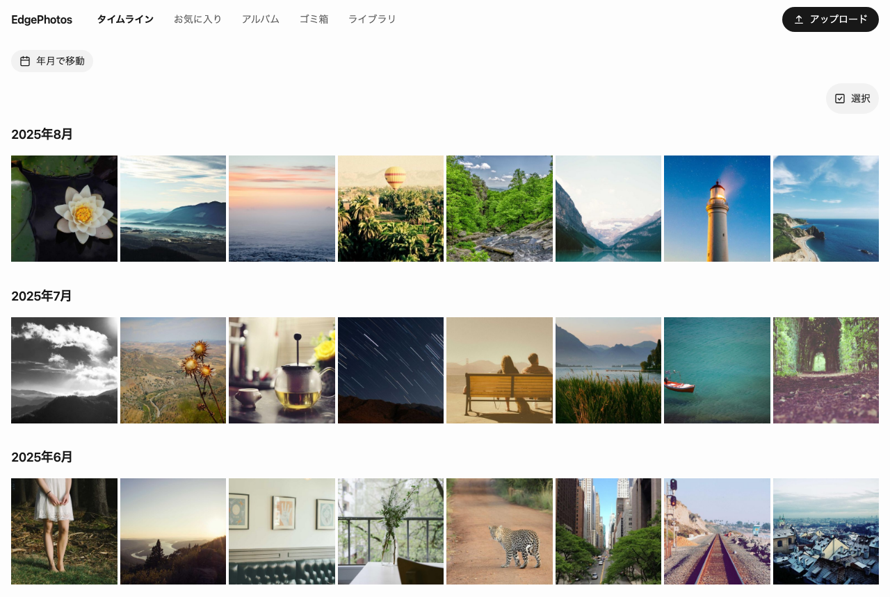

# EdgePhotos

**Your photos. Your Cloudflare account. No server to manage.**

EdgePhotos は、あなた自身の Cloudflare アカウントへデプロイして使う、小さなセルフホスト型の写真ライブラリです。

VPS や NAS を運用せずに、家族の写真を自分の Cloudflare アカウントで管理したい人のために作っています。Google フォトの機能を全部そろえることは目指さず、写真の保存・閲覧・整理・共有と、データを自分で export / restore できることに範囲を絞ります。

> [!WARNING]
> 現在 **alpha** です（[段階の呼び方](docs/roadmap.md#段階の呼び方)）。EdgePhotos を写真の唯一の保存先にしないでください。
>
> 別の場所に原本を残してください。定期的に `pnpm backup export`（2 回目からは差分）と `pnpm backup check` を実行してください（[Backup と export](docs/operations.md#9-backup-と-export)）。



## 状態

実 Cloudflare 環境（`remote-test`）で確認済み:

- Cloudflare Access
- private R2 への直接アップロード
- 共有リンクの発行と失効
- backup / restore

未確認:

- production 環境へのデプロイ
- iPhone / Android 実機からの取り込み

確認した内容と日付は [検証記録](docs/verification.md) にあります。

自分のライブラリの保存内容と記録が食い違っていないかは、ライブラリ画面の「ストレージの点検」または `pnpm storage audit` で確認できます（[監視と点検](docs/operations.md#12-監視と点検)）。

## できること

- 写真のアップロード
- タイムライン
- お気に入り
- アルバム
- 期限付き共有リンク
- 共有の失効・再発行
- ゴミ箱と完全削除
- export / restore
- schema migration を含む更新手順

## 初期版で扱わないもの

- 動画
- Live Photos
- RAW 現像
- 顔認識・AI 検索
- バックグラウンド自動同期
- 利用者ごとに分かれたライブラリ
- 任意クラウドへの抽象化
- 課金

## ローカルで試す

Node.js 22.18 以上と pnpm が必要です。

```bash
pnpm install
pnpm db:migrate:local
pnpm dev              # http://localhost:5173 （Access を模擬した household member として動作）
```

```bash
pnpm check            # typecheck + lint + db:check + cli:check + test + build
```

デプロイ手順と必要な設定は [運用・デプロイ・復元](docs/operations.md) を参照してください。

## データの扱い

### 「original」の意味

original とは、EdgePhotos が受け取った byte 列そのものです。再エンコードも上書きもしません。HEIC / HEIF も、形式をファイルの中身から判定して、そのまま保存します。

写真ピッカーが選択時に別の形式へ変換することがあります（iPhone の Safari では HEIC が JPEG になることがあります）。その場合に保存されるのは変換後の byte 列で、画面にもその形式を表示します。受け取っていないファイルを「保存した」とは表示しません。

HEIC をデコードできない環境からは HEIC を追加できません。その場合は追加せずにその場で知らせます（[D-030](docs/decisions.md#d-030-heic--heif-の-original-を受け付けderivative-を作れる環境かは-probe-で決める)）。

### 写真の公開範囲

- R2 bucket は private のままで、公開しません
- ライブラリへのアクセスは Cloudflare Access を通ります
- 写真本体は、有効期限の短い presigned URL でクライアントと R2 の間を直接流れます
- ライブラリの写真を認証なしで閲覧できるのは、明示的に作った共有リンクからだけです。共有では original を配信しません

脅威モデルと秘密情報の扱いは [セキュリティ](docs/security.md) にあります。

## アーキテクチャ概要

```text
Web: Preact + Signals
        |
        | HTTP/JSON
        v
Cloudflare Access
        |
        v
Cloudflare Worker / Hono
   +---------+---------+
   |                   |
  D1               private R2
metadata        originals / derivatives

写真本体:
Web / Future Native -- presigned PUT/GET --> R2
```

Worker は認証・認可、API、D1 の状態管理、R2 の保存確認、署名 URL の発行を担当します。写真バイナリは通常 Worker を経由しません。

詳細は [アーキテクチャ](docs/architecture.md) を参照してください。

### 設計上のトレードオフ

EdgePhotos は任意のクラウドへ移せる抽象化を持たず、Cloudflare に寄せて作ります。アプリケーションのデプロイ単位を 1 Worker に保てる代わりに、Cloudflare への lock-in を受け入れます（[D-003](docs/decisions.md#d-003-cloudflare-native-の-1-worker-構成とする)）。

## 技術スタック

| 領域 | 採用 |
| --- | --- |
| Web UI | Preact + `@preact/signals` |
| Build | Vite + Cloudflare Vite Plugin |
| Styling / UI | Tailwind CSS v4 + shadcn/ui + Base UI |
| API | Hono + `@hono/zod-openapi` |
| Database | Cloudflare D1 + Drizzle（schema・型・migration 生成） |
| Object storage | private Cloudflare R2 |
| Authentication | Cloudflare Access |
| Deployment | 1 Worker + Static Assets + D1 + R2 |

## ドキュメント

- [アーキテクチャ](docs/architecture.md) — 現在採用している構造と境界
- [セキュリティ](docs/security.md) — 認証・共有・秘密情報・データ保護
- [開発ガイド](docs/development.md) — リポジトリ構成、テスト、CI、開発ルール
- [運用・デプロイ・復元](docs/operations.md) — セットアップ、更新、backup / restore
- [設計判断](docs/decisions.md) — 重要な選択とその理由
- [検証記録](docs/verification.md) — 実環境と Browser で確認した内容
- [測定](docs/benchmarks.md) — scale と取り込み memory の数値
- [ロードマップ](docs/roadmap.md) — これからの実装順序と到達点
- [変更の記録](docs/changelog.md) — 完了した実装段階
- [AGENTS.md](AGENTS.md) — AI / 開発支援ツール向けの作業ガードレール

## ライセンス

MIT License
